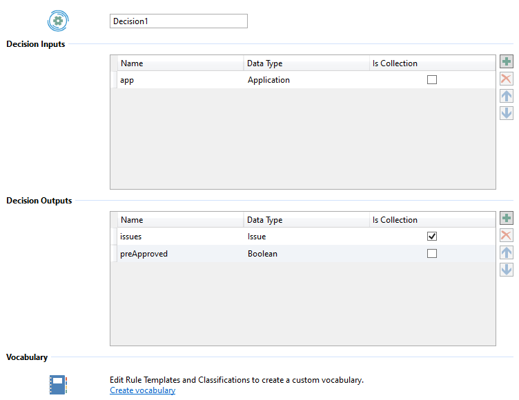

Authoring a Decision in irAuthor
====

# Adding a Decision

A Decision can be added from the Decisions navigation panel.

Every new decision contains a single Rule Set named 'DecisionStart'. Any rules added to that Rule Set will execute automatically when the that Decision is executed.

Additional explicit Rule Sets may be added to the Decision. These Rule Sets will execute only when called from the 'DecisionStart' Rule Set or from other Rule Sets within the same decision via the ExecuteRuleSet action. If an explicit Rule Set in a Decision is not explictly called via ExecuteRuleSet, then that Rule Set will not execute.

Entity based Rule Sets can also be called from a Decision based rule set. This preserves the ability to author rules in the context of an Entity.

# Editing a Decision

When a Decision is selected in the Decisions navigation panel, the irAuthor content panel displays the Decision editor.

## Inputs and Outputs

Inputs and outputs may be added or removed using the  and  buttons next to their data grids.

When an input or output is added to the Decision, its 'Name' and 'Data Type' may be assigned. The Data Type may be any primitive data type inrule supports (Boolean, Data, DateTime, Decimal, Integer, Text), or an Entity previously authored in the Rule Application. An Entity input or output may be defined as an Entity Collection by checking the 'Is Collection' checkbox in the right-hand column.

## Vocabulary

Authors can create a vocabulary that allows them to make rules that read like regular English.  The vocabulary is a collection of English-language phrases, or more accurately, templates of English-language phrases, each connected to a value it will represent, or to an action it will take.

Vocabulary may be authored by clicking the 'Create vocabulary' hyperlink at the bottom of the Decision editor. This allows business language vocabulary to be authored in the context of this Decision, which is available to Rules in any of its Rule Sets.

# Rule Authoring

Rules and actions may be added to Decision Rule Sets the same way that they may be added to Entity Rule Sets or Independent Rule Sets.

All Decision Rule Sets are confined to explicit fire-mode. Any additional Rule Set added to the Decision may define parameters, however the 'DecisionStart' default Rule Set may not.

