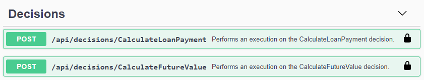
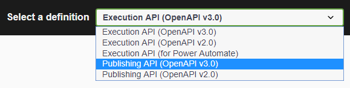
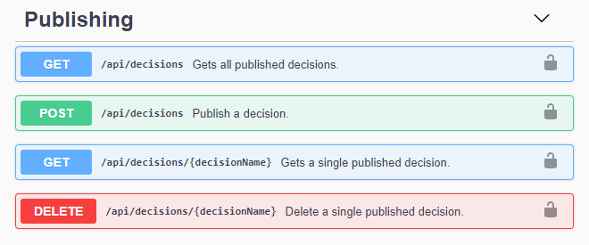
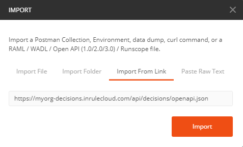
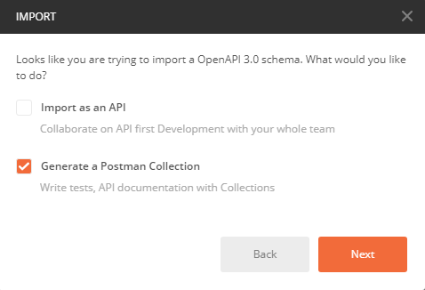
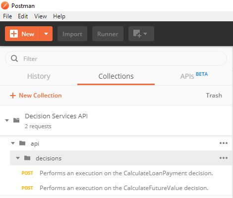
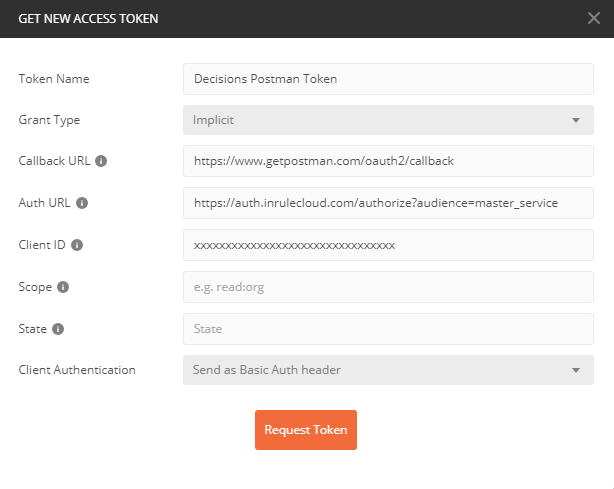
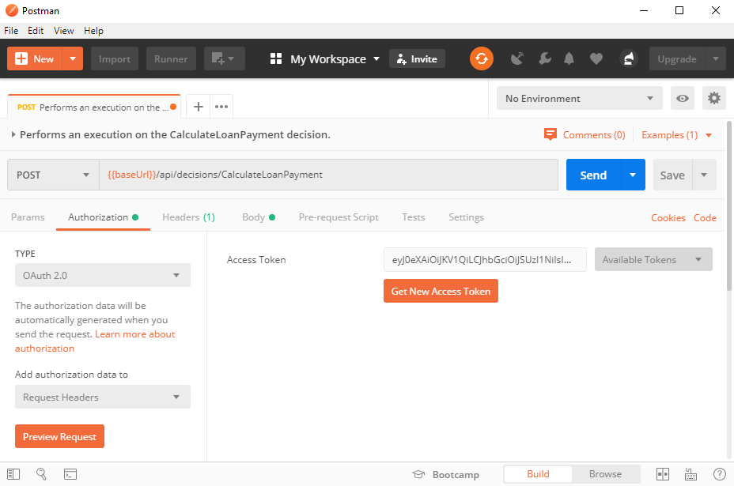
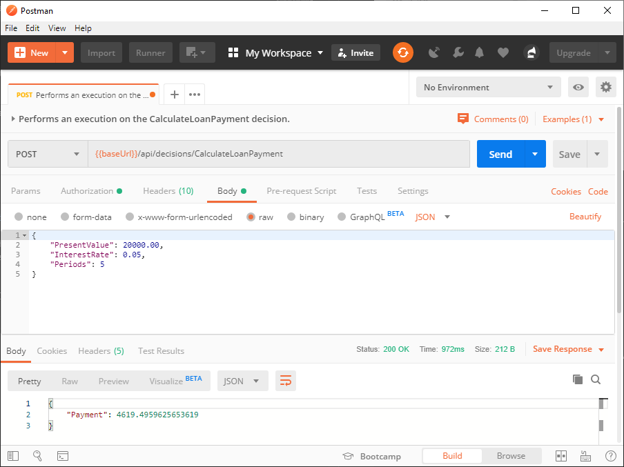

Executing a Decision
====

# Overview

Once a Decision has been published to a Decision Runtime, it is available for execution as a Decision Service.

The base URL of the Decision Runtime will be the same URL used when the Decision was published.

OpenAPI documents are available, which provide details of the URLs and JSON data structures for publishing and executing Decision Services.

For example, if the base URL is:

    https://myorg-decisions.inrulecloud.com/

The OpenAPI 2.0 and 3.0 Specification documents for publishing would be:

    https://myorg-decisions.inrulecloud.com/api/openapi_v2.0.json
    https://myorg-decisions.inrulecloud.com/api/openapi_v3.0.json

The OpenAPI 2.0 and 3.0 Specification documents for executing published Decision Services would be:

    https://myorg-decisions.inrulecloud.com/api/decisions/openapi_v2.0.json
    https://myorg-decisions.inrulecloud.com/api/decisions/openapi_v3.0.json

These documents can be used by Swagger, Postman, or proxy generators for publishing and executing Decision Services.

# Publication/Execution API via Swagger/OpenAPI Specification

The Swagger test page would be accessed at the following URL:

    https://myorg-decisions.inrulecloud.com/openapi/

This explicitly lists all Decision Services available for execution, along with their associated schemas and example input/output JSON.

The Decision Runtime uses OAuth 2.0 for authentication. Before using this interface, user credentials must be authenticated using the 'Authorize' button on the page.

To authorize the Swagger page, a 'client_id' will be required before the authentication window appears. Please contact [InRule Support](mailto:support@inrule.com)  for this client id.

In addition to the 'Execution API', there is also a 'Publishing API' Swagger page that can be found in the drop-down menu at the top-right of the page:

    
The following operations are possible:

- List published Decisions
- Publish a Decision
- Get a Decision (Only confirms the name - Does not permit download of rule application)
- Delete a Decision

*Note: This page also requires authorization.*

# Execution API via Postman

Postman offers an alternative mechanism for testing the Decision Services publication and execution API.

## Import OpenAPI Configuration

Using the Import functionality of the Postman application, the OpenAPI Specification document for executing Decision Services can be imported.

Enable the 'Generate a Postman Collection' option:

After importing the OpenAPI specification, the Decision Services will be available in the collections list:

Double-clicking one of the Decisions will open the form for the POST request.

## Authorization

Before sending the request to execute the Decision Service, the authorization header must be configured with a bearer token. This is retrieved from the OAuth 2.0 authentication service.

Click the 'Authorization' tab and then click the 'Get New Access Token' button. Fill out the new token form using the following values:

- Token Name: `[Any friendly name for the auth token]`
- Grant Type: `Implicit`
- Callback URL: `https://www.getpostman.com/oauth2/callback`
- Auth URL: `https://auth.inrulecloud.com/authorize`
- Client ID: `[Contact InRule Support for the Client ID to use with Postman]`
- Scope: `[Leave empty]`
- State: `[Leave empty]`
- Client Authentication: `Send as Basic Auth header`

Clicking the 'Request Token' button should retrieve a valid bearer token for use in the POST request's authorization header. Scroll down the dialog window containing the bearer token, and click the 'Use Token' button to apply it to the request.

## Configuring Inputs

Click the 'Body' tab on the request and it will display a sample JSON data structure illustrating the data types to use for each input.

    {
        "PresentValue": "<number>",
        "InterestRate": "<number>",
        "Periods": "<integer>"
    }

Change the values of the inputs to reflect the desired test values:

    {
        "PresentValue": 20000.00,
        "InterestRate": 0.05,
        "Periods": 5
    }

## Executing the Decision Service

Once the authorization header is configured with the bearer token and the inputs are populated, simply click the 'Send' button to execute the Decision Service.

The repsonse panel should contain the outputs of the Decision.

If the response 'Status' says `200 OK` then the Decision Service was executed successfully.

# Author-Publish-Execute Code Sample

For an example application that programmatically authors, publishes, and executes a Decision Service, please see the [ExecuteDecisionSample](../../Developer%20Samples/ExecuteDecisionSample) developer sample.