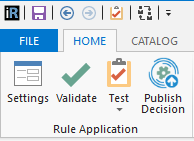
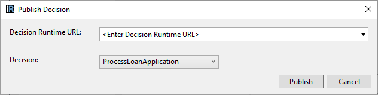
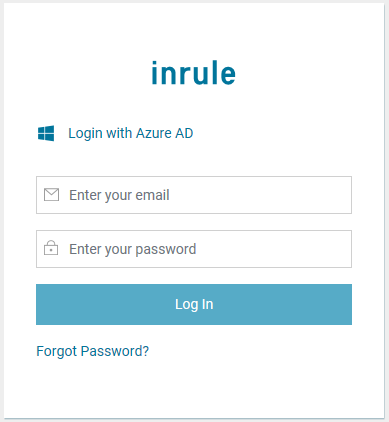
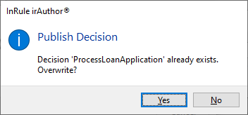
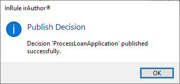

Publishing a Decision
====

irAuthor contains a feature to publish Decisions so they are available for remote execution on the Decision Runtime. The 'Publish Decision' button can be found in the 'Home' tab.

This opens a dialog window to enter the Decision Runtime URL, and select a Decision from the Rule Application to publish.

The Decision Runtime URL must be a valid URL of a Decision Runtime. Any URLs used here will be saved in the drop-down menu for future use. The last used URL will always be at the top of the list.

If a Decision or any of its Rule Sets or Rules are selected in the navigation panel, this will be the Decision selected by default in the 'Decision' drop-down menu, otherwise the first Decision will be selected.

In order to successfully publish a Decision, the user must first be authenticated with the Decision Runtime. If irAuthor is not currently logged in to the centralized authentication, a login window will prompt for the user's email address and password.

When attempting to publish a Decision whose name already exists on the Decision Runtime, a confirmation dialog window will ask whether the existing Decision should be overwritten.

When a Decision is published successfully, a dialog window will confirm this.

