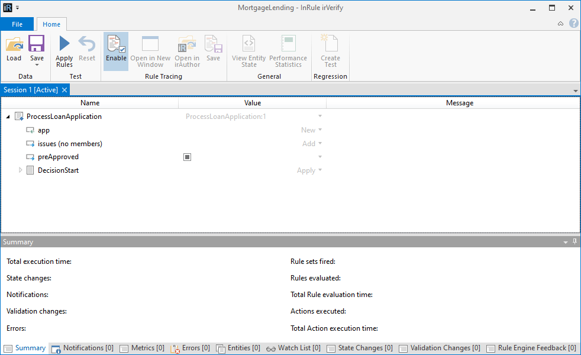

# Testing a Decision

irVerify may be used to test a Decision.

Clicking the 'Test' button on the 'Home' tab will launch irVerify if the item selected in the navigation panel is a Decision or a Rule Set or Rule under a Decision. If the down arrow under the 'Test' button is clicked, a specific Decision may be selected from the drop-down menu.

Here, the input fields may be populated as if they were the values being input to the Decision.

*Note: Setting the output field values in irVerify is discouraged because this is not a scenario that would apply when executed as a Decision Service.*

To execute the Decision, either click the 'Apply' button on the 'DecisionStart' Rule Set, or click the 'Apply Rules' button in the 'Home' tab.

The result of the Decision will be the values of the output fields.

Loading and saving state from a Decision is only supported via .testscenario files.
To load XML/JSON into individual Entities, use the down arrow next to the 'New' button on Entity Fields/Collection Members to load/save state.

