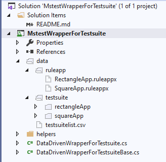
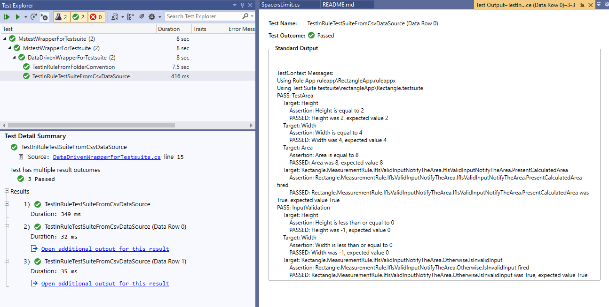
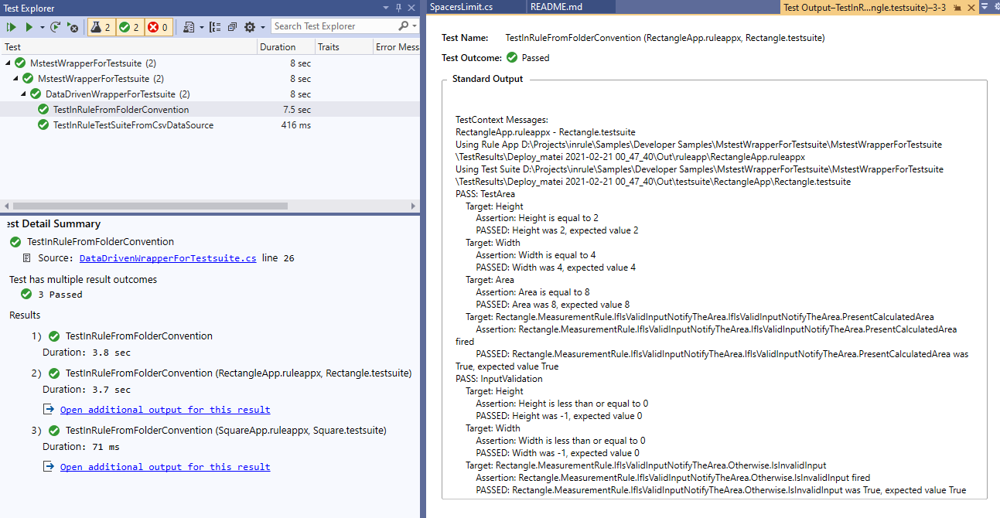

# Integrate a data driven MsTest wrapper for testsuite file

This sample shows how to add a data driven MsTest wrapper on top of a testsuite. It allows to integrate your testsuite in a MsTest report. It creates the preconditions to wire your tests to an Azure Devops CICD pipeline.



It propose two approaches for passing ruleapps and testsuites:

- a csv datasource
- a folder convention data source 

## CSV datasource

It uses a csv file with two columns as in the following example

|RuleaAppFilePath|TestSuiteFilePath|
|--|--|
|ruleapp\RectangleApp.ruleappx|testsuite\rectangleApp\Rectangle.testsuite|
|ruleapp\SquareApp.ruleappx|testsuite\squareApp\Square.testsuite|

```C#
[DataTestMethod]
[DataSource(
    "Microsoft.VisualStudio.TestTools.DataSource.CSV",
    "|DataDirectory|\\data\\testsuitelist.csv",
    "testsuitelist#csv",
    DataAccessMethod.Sequential)]
[DeploymentItem("..\\..\\data")]
public void TestInRuleTestSuiteFromCsvDataSource()
{
    var ruleAppFilePath = TestContext.DataRow["RuleAppFilePath"].ToString();
    var testSuiteFilePath = TestContext.DataRow["TestSuiteFilePath"].ToString();

    TestInRule(ruleAppFilePath, testSuiteFilePath);
}
```



## Folder convention data source 

By convention all the testSuite files related to a ruleapp
will be placed under a subfolder of testSuitePath named after the ruleapp
for example, if ruleAppPath = "ruleapp", testSuitePath = "testsuite"
the folder structure will be as follows

    ├───ruleapp
    │       RectangleApp.ruleappx
    │       SquareApp.ruleappx
    │
    └───testsuite
        ├───rectangleApp
        │       Rectangle.testsuite
        │
        └───squareApp
                Square.testsuite


```C#
[DataTestMethod]
[FolderConventionDataSource(ruleAppPath: "ruleapp", testSuitePath: "testsuite")]
[DeploymentItem("..\\..\\data")]
public void TestInRuleFromFolderConvention(string ruleApp, string testSuite, string ruleAppFilePath, string testSuiteFilePath)
{
    TestContext.WriteLine($"{ruleApp} - {testSuite}");

    TestInRule(ruleAppFilePath, testSuiteFilePath);
}
```


